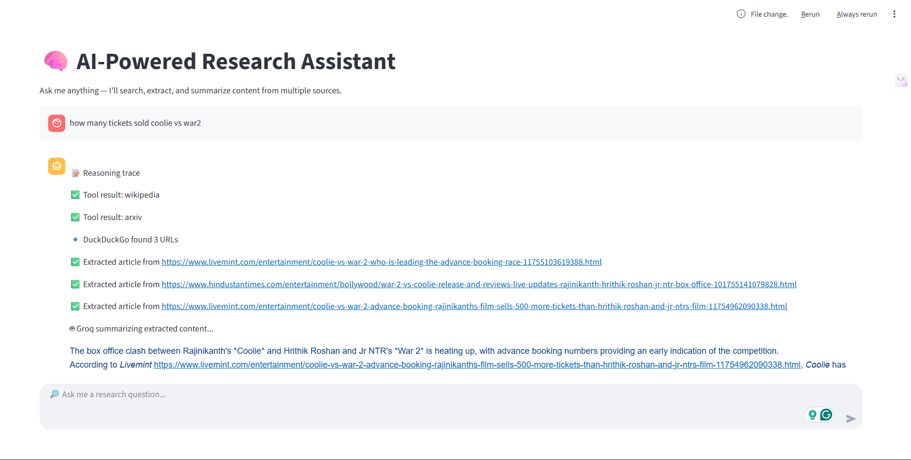
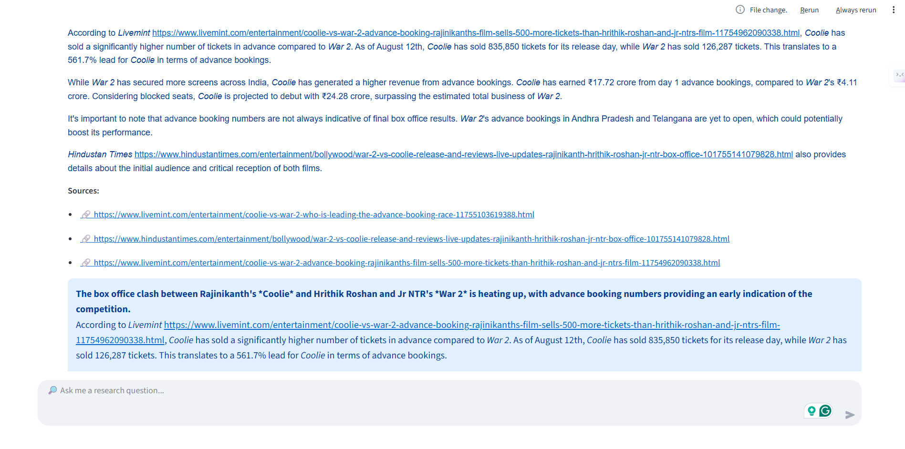
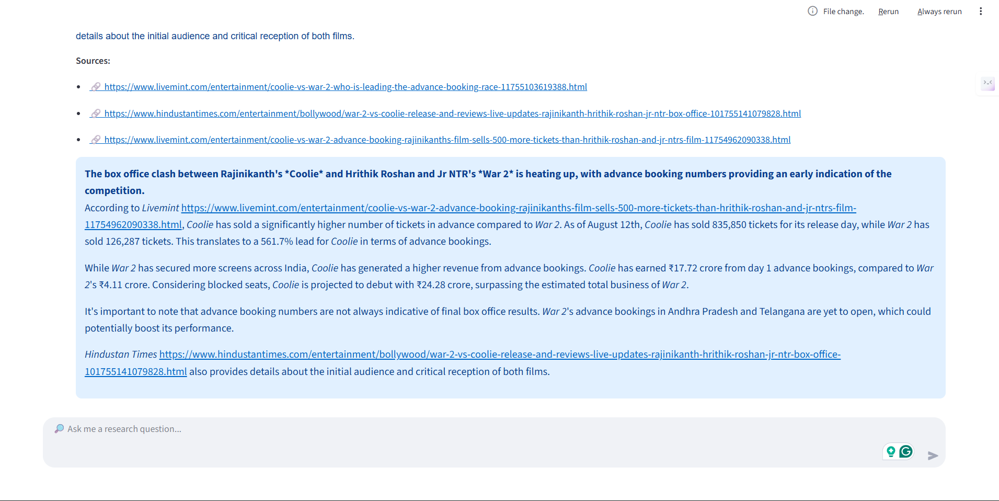

# 🧠 AI-Powered Research Assistant

An intelligent research assistant built with **Streamlit** that takes any user question, gathers information from multiple online sources, and provides a concise, summarized answer powered by **Groq AI**.





---

## 🔹 Features

- **Multi-Source Data Aggregation**: Fetches information simultaneously from:

  - Wikipedia (encyclopedic knowledge)
  - Arxiv (scientific papers and preprints)
  - DuckDuckGo (web search)

- **AI-Powered Summarization**: Uses the high-speed `gemma2-9b-it` model via Groq for concise summaries.
- **Robust Content Extraction**: Employs Goose3 for intelligent article extraction, with fallback to `requests` + `BeautifulSoup`.
- **Transparent Process**: Displays a “Reasoning Trace” showing which steps and sources were used.
- **Interactive Chat UI**: Clean Streamlit-based interface with chat history.
- **Proper Sourcing**: Answers include linked Markdown sources for verification.

---

## 📝 How It Works (Process Flow)

The application follows a clear, multi-step process to answer a user's query.

```
flowchart TD
A[👨‍💻 User Enters a Research Question] --> B{Data Collection Stage};
B --> C[🔎 Query Wikipedia API];
B --> D[📄 Query Arxiv API];
B --> E[🌐 Search DuckDuckGo for URLs];

    subgraph "Content Extraction & Processing"
        direction LR
        E --> F[✨ Extract Article Text via Goose3];
        F --> G{Content Found?};
        G -- No --> H[⚙️ Fallback: Use Requests + BeautifulSoup];
        G -- Yes --> I[📚 Combine Extracted Texts];
        H --> I;
    end

    C & D --> J[📋 Collect Snippets];
    I & J --> K[🤖 Send All Context to Groq AI];
    K --> L[✅ Generate Summarized Answer];
    L --> M[✨ Display Formatted Answer & Sources];
    A --> M;
```

**Step-by-step:**

1. **User Input** → User enters a question.
2. **Parallel Data Collection** → Wikipedia + Arxiv + DuckDuckGo search.
3. **Article Extraction** → Goose3 extracts content (fallback: BeautifulSoup).
4. **AI Summarization** → Groq AI compiles and summarizes.
5. **Display Results** → Answer + sources + reasoning trace shown in UI.

---

## ⚙️ Setup and Installation

### Prerequisites

- Python 3.8+
- Internet connection

### 1. Clone the Repository

```bash
git clone <your-repository-url>
cd <repository-directory>
```

### 2. Install Dependencies

It is recommended to use a virtual environment.

```bash
# Create and activate a virtual environment
python -m venv venv
source venv/bin/activate   # On Windows: venv\Scripts\activate

# Install required packages
pip install streamlit goose3 langchain-groq langchain-community ddgs beautifulsoup4 requests
```

### 3. Configure Your API Key

You need a **Groq API key** for summarization.

- Get a free API key from **GroqCloud**.
- Open `app.py` and replace the placeholder:

```python
# 🔴 Replace with your actual Groq API key
GROQ_API_KEY = "gsk_YOUR_GROQ_API_KEY_HERE"
```

### 4. Run the Streamlit App

```bash
streamlit run app.py
```

Your browser will open automatically to the app’s URL.

---

## 🔧 Customization

- **Change the AI Model**

```python
llm = ChatGroq(model="llama3-70b-8192", api_key=GROQ_API_KEY)
```

- **Adjust Search Results**

```python
ddg_urls = fetch_valid_urls(question, max_results=5)  # default is 3
```

- **Modify Content Length**

```python
extracted = extract_article_text(url, max_chars=5000)
```

---
